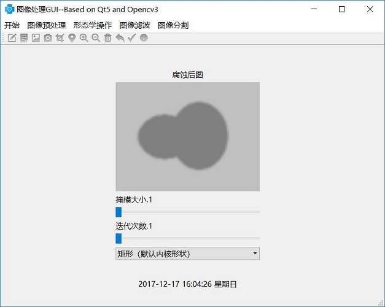

# Image-Processing-GUI
A GUI with Opencv3 and Qt5 for Image Processing
It includes: image preprocessing; morphological manipulation; image filtering; image segmentation.

Image preprocessing mainly consists of the following five parts:

① grayscale.

② binary.

③ contrast and brightness.

④ histogram equalization.

⑤ sets ROI.

The morphological processing mainly consists of the following seven parts:

① dilation and erosion.

② open and close operation.

③ gradient, top hat, black hat operation.

④ fills the hole.

⑤ removes small area.

⑥ morphological reconstruction.

⑦ Extraction and description of contour.

Image filtering processing mainly includes the following five kinds of filtering:

① box filter.

② mean value filtering.

③ Gaussian filter.

④ median filter.

⑤ bilateral filtering.

Image segmentation mainly includes the following five types of segmentation:

① OSTU

② edge detection operator(Canny, Sobel, Laplacian)

③ regional growth method

④ Grabcut

⑤ Level Set segmentation

 